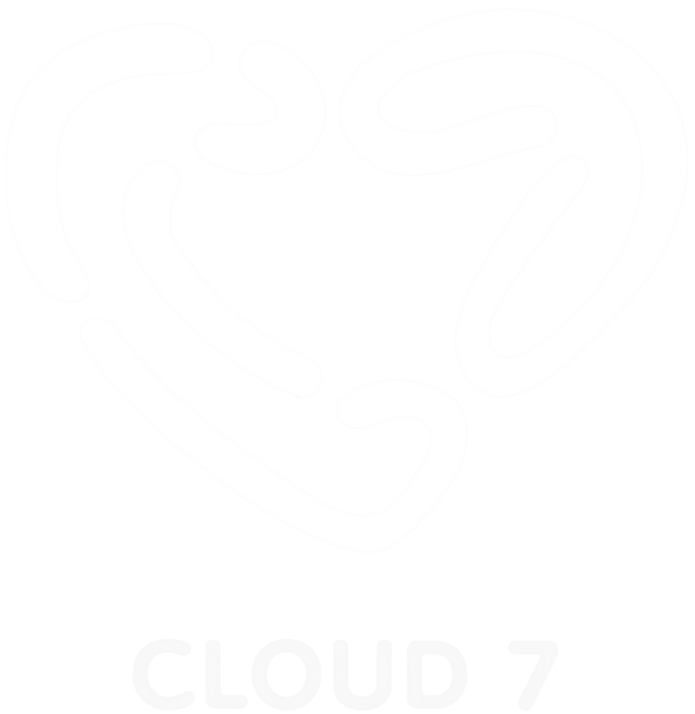

# The Cloud House OG - Project Documentation

## Project Overview
**The Cloud House OG** is the official recruitment and community hub for Cloud 7, a Philippine P-pop (PPop) boy group managed by Sparkle GMA Artist Center. This is a landing page and information site to recruit new members to the official group chats.

**Group Chat Details:**
- **Created**: June 10, 2024
- **Approved By**: Sir Jay Lyson and Tita Sarah Angeles
- **Distinction**: First group approved at that time
- **Community**: Includes dedicated fans, supporters, and parents of Cloud 7 members

## Cloud 7 Information
- **Group**: Cloud 7 (Official P-pop boy group)
- **Members**: 7 members aged 13-19
  - Julijo Lukas Garcia (Leader)
  - Prince Johann Nepomuceno
  - Kairo Lazarte
  - Egypt Larkin See
  - Miguel Gabriel "Migz" Diokno
  - Prince Johan "PJ" Yago
  - Fian Andrei Guevarra
- **Label**: Sparkle GMA Artist Center
- **Debut**: August 20, 2023
- **Official Launch**: May 23, 2025
- **Genre**: Dance-Pop, P-pop

## Official Links

### Cloud 7
- Official Facebook: https://web.facebook.com/cloud7.official

### The Cloud House OG
- Official FB Page: https://www.facebook.com/share/1DA9ZWanAj/
- Pending GC Link: https://m.me/j/Abaqc3_xY0Sc14T0/

### Cloud 7 Universe (Official Fan Group Chat)
- Official FB Page: https://www.facebook.com/share/1CQT8Yrjop/

## Admin Team & Contact Links

### Head Admin
- **EJ Juan** - https://m.facebook.com/61580158862131/

### Co-Owners
- **Jeylo Baoit** - https://www.facebook.com/stc.primo/
- **Gayve Mykaella** - https://m.facebook.com/gayve.mykaella.2024/

### Assistant Admins
- **Alvin Batingan** - https://m.facebook.com/Vin.yoshihiko.2010/
- **Maria Nicol Ortiz** - https://m.facebook.com/ria.nic.zin/

### Moderators
- **Louisse Bautista** (Head Moderator) - https://m.facebook.com/louisse.bautista.2024/
- **Claire Adriano** - https://m.facebook.com/ashieeadriano.01/
- **Allysa Zurita** - https://m.facebook.com/Alyssa.Zurita13/

### Support Team
- **Angel** (Editor) - https://m.facebook.com/ann.gela.953453/
- **Vi Cen Te** (Social Media Handler) - https://m.facebook.com/realvicente.0498/

## Tech Stack
- **HTML5** - Semantic markup
- **CSS3** - Separate stylesheet (mobile-first responsive)
- **Vanilla JavaScript** - No frameworks, modular code
- **Chart.js** - Admin role distribution pie chart (CDN)
- **Google Fonts** - Poppins font family
- **External Images** - Wikipedia images for Cloud 7 group photo

## Project Structure
```
/tchwebsite
├── index.html              # Home page
├── about.html              # About Cloud 7 & group chat mission
├── collabs.html            # Collaborations (Cloud 7 Universe)
├── team.html               # Admin team hierarchy & chart
├── join.html               # Join page with admin contacts
├── /css
│   └── styles.css          # All styling (BEM naming)
├── /js
│   └── script.js           # Chart initialization, smooth scroll
├── /assets
│   ├── logo.png            # The Cloud House OG circular logo
│   └── cloud7-logo.png     # Cloud 7 official logo (PLACEHOLDER - to be added)
└── CLAUDE.md               # This file
```

## Key Features
- ✅ Circular Cloud House OG logo in navbar
- ✅ Cloud 7 group photo from Wikipedia (no local storage)
- ✅ Responsive design (mobile-first approach)
- ✅ Admin hierarchy display with 6 roles
- ✅ Admin role distribution pie chart
- ✅ Direct Messenger group chat link
- ✅ Fallback contact info (if GC full)
- ✅ All admin Facebook profile links
- ✅ Smooth scrolling navigation
- ✅ Hover effects and animations
- ✅ Cloud theme (sky blue, gradient, floating clouds)

## Asset Information

### Images Used
- **The Cloud House OG Logo**: `/assets/logo.png` (circular, 50x50px in navbar)
- **Cloud 7 Group Photo**: Wikipedia external link
  - URL: `https://upload.wikimedia.org/wikipedia/commons/thumb/f/f2/CLOUD_7_2024.jpg/330px-CLOUD_7_2024.jpg`
  - Caption: "Cloud 7 (2024): Fian, Kairo, Lukas, Egypt, PJ, Migz, and Johann"

### Logo Placeholders Ready for Assets
- **Hero Section**: `id="cloud7-hero-logo"` (max-height: 120px)
- **About Section**: `id="cloud7-about-logo"` (max-height: 100px)

To add Cloud 7 official logo later:
```html

```

## Design System

### Colors
- Primary: #87CEEB (Sky Blue)
- Primary Dark: #4A90E2
- Accent: #FFB6C1 (Light Pink)
- Text: #2C3E50
- Text Light: #5A6C7D
- White: #FFFFFF

### Typography
- Font Family: Poppins (Google Fonts)
- Weights: 300, 400, 600, 700
- Responsive sizing with viewport scaling

### Spacing
- xs: 0.5rem
- sm: 1rem
- md: 1.5rem
- lg: 2rem
- xl: 3rem
- 2xl: 4rem

## CSS Architecture
- **BEM-style naming**: `.block__element--modifier`
- **CSS Variables**: For maintainability and consistency
- **Mobile-first approach**: Base styles then media queries
- **Responsive breakpoints**:
  - 768px: Tablets
  - 480px: Mobile phones

## Page Descriptions

### index.html (Home)
- Hero section with Cloud 7 branding
- Quick navigation cards
- Stats section
- Social links to official pages
- Footer

### about.html (About Cloud 7)
- Cloud 7 group info and photo
- Group member list
- Label and genre info
- Mission statement
- Values section (4 cards)

### collabs.html (Collaborations)
- Cloud 7 Universe info
- Active and upcoming collaborations
- Call-to-action to join

### team.html (Admin Team)
- Hierarchical team display (6 roles)
- Admin role distribution pie chart
- Clickable profile links for EJ Juan and Jeylo

### join.html (Join Page)
- Direct Messenger group chat link
- Fallback admin contact info
- Important links (official pages + admin profiles)
- Member benefits list

## Deployment Notes

### Ready for:
- ✅ Netlify
- ✅ Vercel
- ✅ GitHub Pages
- ✅ Standard web hosting

### No Build Process Required
- Pure HTML/CSS/JavaScript
- External CDN dependencies only (Chart.js, Google Fonts)

### Before Deployment
- [ ] Add Cloud 7 official logo to `/assets/cloud7-logo.png`
- [ ] Update Cloud 7 logo image sources in HTML
- [ ] Test all links (Messenger, Facebook pages, admin profiles)
- [ ] Test on mobile devices
- [ ] Verify all external images load correctly

## Important Notes
- All external images use Wikipedia and Wikimedia URLs (no local storage)
- All admin contact links go to Facebook profiles
- Messenger link is the primary join method
- Admin contacts are fallback for when pending GC is full
- No forms or backend required - all links are external
- Chart.js initialized only on team page when element exists

## Future Enhancements (Optional)
- [ ] Mobile hamburger menu (currently full navbar wraps)
- [ ] Dark mode toggle
- [ ] Additional Cloud 7 Universe subpages
- [ ] Event/schedule calendar
- [ ] Fan gallery section
- [ ] Blog/updates section
- [ ] Email newsletter signup
